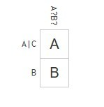

### a. Create and setup a Github account (You can skip this part if you already have one)
Done

### b. Create a bio page in your repository titled bio.md
Done

### c. Reading assignments - make sure to reflect on these in a lab1.md file in your repository
1. If you don't want to hurt the feelings of other people when answering a question, just say that you cannot answer the question.
2. When you don't know an answer to a question, try coming up with something that you know most related to the question.

From the reading I noticed that more than 65 percent of RPI's undergraduates finished top 10 percent of their high school class. Although not being one of them, I am extremely proud to be an RPI student. I also learned that if you tried to access a file through a Windows browser that was on a computer that was off-line, your computer could crash. More to that, I learned that if you do not need to be a CS student in order to make a search engine. Making a search engine might include certain risks involving lawsuits that would make you pay 15 miliion dollars. In order to prevent these risks from happening, the search engine creator must be careful of not including one fourth of its files as music files. I learned a lot from this reading and it would benefit me in the future.

### d. Linux

### e. Regex

### f. Play with Snap or CSDT or Blockly

### g. Reflection
I would like to reflect on YACS which stands for Yet Another
Course Scheduler (https://github.com/robinm8/yacs). YACS is an RCOS project at RPI. The primary goal of YACS is to make scheduling easier for students in generating multiple schedules without conflicts.  Those who have the experience of using SIS (student information system) to search for classes would most likely agree with the fact that the UI is not user friendly. Therefore, YACS serves as the secondary system for students who are struggling with SIS to generate schedule. The UI of YACS is extremely simple and well organized.
