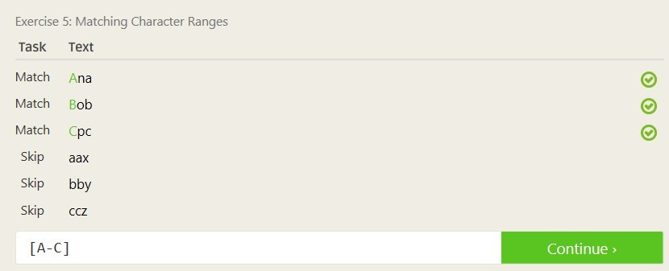

### a. Create and setup a Github account (You can skip this part if you already have one)
Done

### b. Create a bio page in your repository titled bio.md
Done

### c. Reading assignments - make sure to reflect on these in a lab1.md file in your repository

### d. Linux

### e. Regex

### f. Play with Snap or CSDT or Blockly

### g. Reflection
