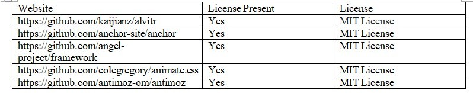

### 
2. A software licence is a legal instrument allowing consumers to use or redistribute software. The particular licence agreement will explain to the end-user how they can use the software.

###
3. Without a licence, data may be publicly unavailable. Without a licence, you leave yourself liable to a potential lawsuit which is quite costly.

###
4. I believe in the statement because gopher does not support hypertext which modern day internet should be providing. The idea that people used more resources developing the web also contributed to the demise of Gopher.

###
5. Android is about freedom and choice. The purpose of Android is to promote openness in the mobile world, and the developers don't believe it's possible to predict or dictate all the uses to which people will want to put their software. So, while they encourage everyone to make devices that are open and modifiable, they don't believe it is their place to force them to do so. Using LGPL libraries would often force them to do just that. 

###
6. Apache Licence 2.0

###
7. GPL: You may copy, distribute and modify the software as long as you track changes/dates in source files. Any modifications to or software including (via compiler) GPL-licensed code must also be made available under the GPL along with build & install instructions. GPL best fits for a developer. LGPL: This license is mainly applied to libraries. You may copy, distribute and modify the software provided that modifications are described and licensed for free under LGPL. Derivatives works (including modifications or anything statically linked to the library) can only be redistributed under LGPL, but applications that use the library don't have to be. LGPL best fits for companies. Apache: You can do what you like with the software, as long as you include the required notices. This permissive license contains a patent license from the contributors of the code. Apache best fits the community.

###
9. The project that I would like to work on is an ingredient replacement application for people who have allergies. The users can be anyone in the world. Users would use this app will input their allergens and search for a replacement that also have similar taste to what they are allergic to. The Licence that would be used is GPL. I do not want other programmers to modify the original code. What I want help on is the database for the replacement ingredients.

###
10. 

