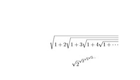
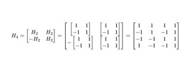

### Part 0 - Documentation
1. 
i. The problem area that my software is researching is on how to give students a convenient way to schedule their courses.
ii.  YACS
iii. Calender
iv. The end product would be a calender that has the student's schedule on it.

### Part 1 - Community
1. I am a member of table 11 and assigned of the last 5 projects.
2. Done
3. 
- Technical Professionalism
    - contributors: 1
    - lines of code: 0
    - first commit: January 22, 2019
    - latest commit: January 22, 2019
    - current branches: master
- The smart scheduler
    - contributors: 1
    - lines of code: 0
    - first commit: 1/25/2019
    - latest commit: 1/25/2019
    - current branches: master 
- Tornado
    - contributors: 2
    - lines of code: 15872
    - first commit: December 11, 2018
    - latest commit: January 28, 2019
    - current branches: master
- venue
    - contributors: 1
    - lines of code: 0
    - first commit: January 22, 2019
    - latest commit: January 22, 2019
    - current branches: master
- YACS
    - contributors: 47
    - lines of code: 37856
    - first commit: 9/16/2015
    - latest commit: 1/24/2019
    - current branches: 21
   
