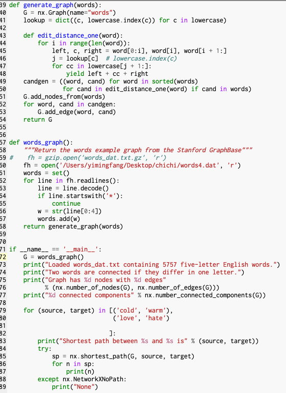

#### 1. Your results for the 4 five letter pairs
##### Shortest path between chaos and order is
chaos
chats
coats
colts
colas
codas
codes
coder
cider
eider
elder
older
order
##### Shortest path between nodes and graph is
nodes
modes
moles
molds
golds
goads
grads
grade
grape
graph
##### Shortest path between moron and smart is
moron
boron
baron
caron
capon
capos
capes
canes
banes
bands
bends
beads
bears
sears
stars
start
smart
##### Shortest path between pound and marks is
None

#### 2. Your code for the four letter solution

#### 3. Your results for the 2 four letter pairs

#### 4. Your code for the unordered solution

#### 5. Your results for the 4 five letter pairs using the unordered implementation

